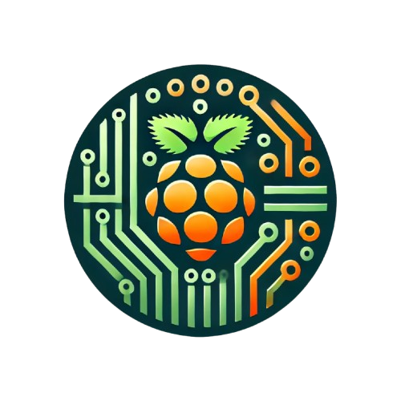

<!-- Improved compatibility of back to top link: See: https://github.com/othneildrew/Best-README-Template/pull/73 -->
<a id="readme-top"></a>
<!-- PROJECT SHIELDS -->
[![Contributors][contributors-shield]][contributors-url]
[![Forks][forks-shield]][forks-url]
[![Stargazers][stars-shield]][stars-url]
[![Issues][issues-shield]][issues-url]
[![project_license][license-shield]][license-url]
[![LinkedIn][linkedin-shield]][linkedin-url]


<!-- PROJECT LOGO -->
<br />
<div align="center">
  <a href="https://github.com/jeremyalbrecht/ha-rpi-connector">
    
  </a>

<h3 align="center">Home Assistant - Raspberry Pi Connector</h3>

  <p align="center">
    project_description
    <br />
    <a href="https://github.com/jeremyalbrecht/ha-rpi-connector"><strong>Explore the docs »</strong></a>
    <br />
    <br />
    <a href="https://github.com/jeremyalbrecht/ha-rpi-connector/issues/new?labels=bug&template=bug-report---.md">Report Bug</a>
    ·
    <a href="https://github.com/jeremyalbrecht/ha-rpi-connector/issues/new?labels=enhancement&template=feature-request---.md">Request Feature</a>
  </p>
</div>


<!-- TABLE OF CONTENTS -->
<details>
  <summary>Table of Contents</summary>
  <ol>
    <li>
      <a href="#about-the-project">About The Project</a>
      <ul>
        <li><a href="#built-with">Built With</a></li>
      </ul>
    </li>
    <li>
      <a href="#getting-started">Getting Started</a>
      <ul>
        <li><a href="#prerequisites">Prerequisites</a></li>
        <li><a href="#installation">Installation</a></li>
      </ul>
    </li>
    <li><a href="#usage">Usage</a></li>
    <li><a href="#roadmap">Roadmap</a></li>
    <li><a href="#contributing">Contributing</a></li>
    <li><a href="#license">License</a></li>
    <li><a href="#contact">Contact</a></li>
  </ol>
</details>


<!-- ABOUT THE PROJECT -->
## About The Project

How to get various components connected to a Raspberry Pi using GPIO integrated into Home Assistant ? Using this 
connector you will be able to plug devices into your raspberry Pi, and control them from Home Assistant.

The communication with Home Assistant is established using MQTT.

Configuration needs to be done at two places:
* on the Raspberry Pi with the YAML configuration file to define the devices, inputs and outputs of the device
* on Home Assistant, using the configuration.yaml file to define the MQTT broker and the devices

<p align="right">(<a href="#readme-top">back to top</a>)</p>


### Built With

* [![Python][Python]][Python-website]
* [rpi[rpi]][rpi-website]

<p align="right">(<a href="#readme-top">back to top</a>)</p>


<!-- GETTING STARTED -->
## Getting Started

To use the project on a freshly installed Raspberry Pi, follow these simple steps.
```sh
git clone https://github.com/jeremyalbrecht/ha-rpi-connector
cd ha-rpi-connector/
python3 -m venv venv
source venv/bin/activate
pip install -r requirements.txt
cat >> conf/default.yaml <<'EOF'
devices:
- id: 1
class: garage
gpio:
  - name: status
    type: input
    gpio: 18
  - name: control
    type: output
    gpio: 20
    default: high
mqtt:
host: localhost
port: 1883
username: ""
password: ""
mock_gpio: false
EOF
export PYTHONPATH=$PWD
python3 src/main.py
  ```

<p align="right">(<a href="#readme-top">back to top</a>)</p>


<!-- USAGE EXAMPLES -->
## Upgrading

```sh
  git pull origin master
 ```

<p align="right">(<a href="#readme-top">back to top</a>)</p>


<!-- ROADMAP -->
## Roadmap

- [ ] Addition of others animations for StripDevice
- [ ] Support RGB mode for LightDevice
- [ ] Support for brightness for LightDevice

<p align="right">(<a href="#readme-top">back to top</a>)</p>


<!-- CONTRIBUTING -->
## Contributing

Contributions are what make the open source community such an amazing place to learn, inspire, and create. Any contributions you make are **greatly appreciated**.

If you have a suggestion that would make this better, please fork the repo and create a pull request. You can also simply open an issue with the tag "enhancement".
Don't forget to give the project a star! Thanks again!

1. Fork the Project
2. Create your Feature Branch (`git checkout -b feature/AmazingFeature`)
3. Commit your Changes (`git commit -m 'Add some AmazingFeature'`)
4. Push to the Branch (`git push origin feature/AmazingFeature`)
5. Open a Pull Request

<p align="right">(<a href="#readme-top">back to top</a>)</p>


<!-- LICENSE -->
## License

Distributed under the MIT License. See `LICENSE.md` for more information.

<p align="right">(<a href="#readme-top">back to top</a>)</p>


<!-- CONTACT -->
## Contact

Jérémy Albrecht - ajeremyalbrecht@gmail.com

Project Link: [https://github.com/jeremyalbrecht/ha-rpi-connector](https://github.com/jeremyalbrecht/ha-rpi-connector)

<p align="right">(<a href="#readme-top">back to top</a>)</p>


<!-- MARKDOWN LINKS & IMAGES -->
<!-- https://www.markdownguide.org/basic-syntax/#reference-style-links -->
[contributors-shield]: https://img.shields.io/github/contributors/github_username/repo_name.svg?style=for-the-badge
[contributors-url]: https://github.com/github_username/repo_name/graphs/contributors
[forks-shield]: https://img.shields.io/github/forks/github_username/repo_name.svg?style=for-the-badge
[forks-url]: https://github.com/github_username/repo_name/network/members
[stars-shield]: https://img.shields.io/github/stars/github_username/repo_name.svg?style=for-the-badge
[stars-url]: https://github.com/github_username/repo_name/stargazers
[issues-shield]: https://img.shields.io/github/issues/github_username/repo_name.svg?style=for-the-badge
[issues-url]: https://github.com/github_username/repo_name/issues
[license-shield]: https://img.shields.io/github/license/github_username/repo_name.svg?style=for-the-badge
[license-url]: https://github.com/github_username/repo_name/blob/master/LICENSE.txt
[Python]: https://img.shields.io/badge/python-3670A0?style=for-the-badge&logo=python&logoColor=ffdd54
[Python-website]: https://www.python.org/
[rpi]: https://img.shields.io/badge/-RaspberryPi-C51A4A?style=for-the-badge&logo=Raspberry-Pi
[rpi-website]: https://www.raspberrypi.org/